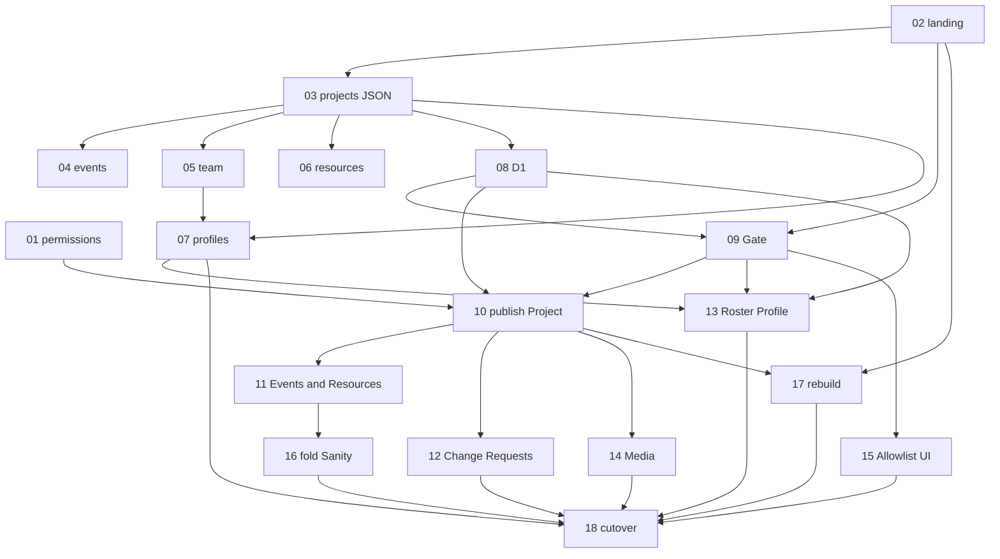

# Rewrite (complete)

Spec: [spec.md](spec.md). Tickets: [issues/](issues/). Tickets **01–18 are `Status: done`**. This folder is the archive of the Next + Supabase + Sanity → Astro + D1 + R2 cutover. New work follows [AGENTS.md](../../AGENTS.md), not a new ticket in this series.

## Phases (for humans)

1. **Foundation** — 01, 02
2. **Public static from JSON** — 03–07
3. **Store and Gate** — 08, 09
4. **Editor** — 10–15
5. **One CMS** — 16
6. **Free-tier production** — 17, 18
